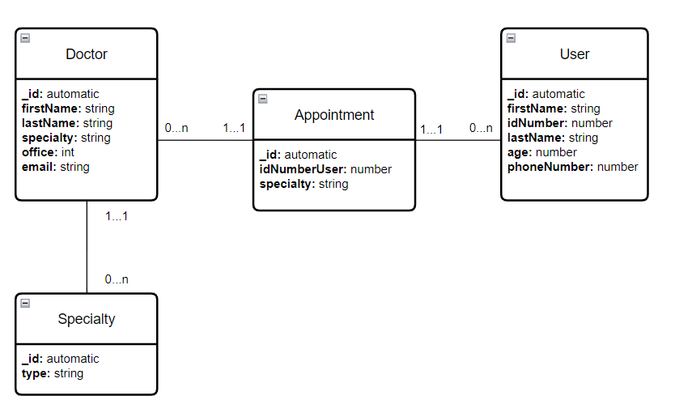

# Aplicación de citas
## Features
Aplicativo que ejecuta operaciones CRUD por medio de una API REST básica. Permite realizar las siguientes acciones:

- Crear un doctor con una especialidad
- Crea un usuario (No se permite mas de un usuario con el mismo número de documento de identidad)
- Crear una cita para un usuario específico y una especialidad existente de algún doctor
- Verificar todos los doctores disponibles
- Verificar todos los usuarios disponibles
- Verificar todas las citas disponibles
- Editar o eliminar los doctores existentes
- Editar o eliminar los usuarios existentes. La edición de usuarios no permite editar el documento de identidad
- Editar o eliminar las citas existentes
- Buscar las citas para cada usuario por documento de identidad
- Filtar las citas por especialidad

## Módelo de datos
En la siguiente imagen se observa el módelo de datos (diagrama) sobre el cual se crearon los modelos para las colecciones de la base de datos no relacional. 



Se realiza un diagrama donde se visualizan las colecciones creadas en la base de datos:

- Doctor
- User
- Appointment
- Specialty

Se crea una colección con las especialidades, con el fin de que al crear un doctor, se valide si la especialidad esta contenida en dicha colección y por ende, es permitido crear al Doctor.

## Tecnologías utilizadas
Se utilizaron las siguientes tecnologías:

- [Node.js](https://nodejs.org/en)
- [Express](https://expressjs.com/es/)
- [MongoDB](https://www.mongodb.com/)
- [EJS](https://ejs.co/)

Se utilizan los siguientes paquetes

- [nodemon](https://nodemon.io/)
- [dotenv](https://github.com/motdotla/dotenv#readme)
- [ejs](https://ejs.co/)
- [express-validator](https://express-validator.github.io/docs)
- [mongoose](https://mongoosejs.com/)

## Orden del proyecto
Se crean las siguientes carpetas (con una breve explicación de su contenido)

- controllers -> Archivos que manejan la lógica una vez se realiza el enrutamiento por medio del EndPoint y del verbo HTTP.
- database -> Contiene un archivo con la conexión a la BD.
- helpers -> Contiene un archivo que realiza validaciones básicas una vez el usuario realiza POST o PUT por medio de los formularios de ingreso o actualización. Revisa los datos ingresados y verifica si los datos son correctos. 
- middlewares -> Contiene un archivo con middlewares.
- models -> Posee los modelos y Schemas que se utilizan para el ingreso de datos a la base de datos. Adicionalmente posee la clase Server que es el punto de entrada para el levantamiento del servidor.
- public -> Archivos CSS y JS que se utilizan desde el lado del FrontEnd. Posee los archivos que se utilizan para editar, eliminar, buscar y filtrar, con sus respectivas peticiones desde el Front al Back.
- routes -> Contiene los archivos que permiten enrutar las peticiones realizadas por los usuarios.
- views -> Contiene los archivos EJS que renderizan las vistas en el FrontEnd. 

## Instalación

1. Clonar el repositorio con el siguiente comando

```
git clone https://github.com/jucramirezay/doctor_appointments.git
cd doctor_appointments
```

2. Instalar los paquetes requeridos

```
npm install 
```

3. Correr el siguiente comando para iniciar el proyecto

```
npm run dev
```

!!! Importante: Para ejecutar el comando anterior se require tener instalado nodemon de forma global en el equipo

4. Abrir el explorador en la ruta https://127.0.0.1:3000

El archivo .env debe ser creado para que la API funcione, teniendo en cuenta especialmente la conexión con la BD. Las variables que se deben crear en el archivo .env para que el proyecto funcione correctamente son:

- PORT
- HOST
- DB_CONNECTION

PORT simboliza el puerto de conexión del servidor (3000). HOST simboliza el host sobre el cual se levantara el servidor (127.0.0.1). DB_CONNECTION es el String de conexión a la BD no relacional de MongoDB (link de conexión que es entregado en Mongo Atlas), que incluye usuario y contraseña para el correcto ingreso. 

## Información personal
Creador: Juan Camilo Ramírez
Licencia: MIT License
Curso: ATENEA - Universidad Distrital - Todos a la U
Fecha realización: 04/07/2023