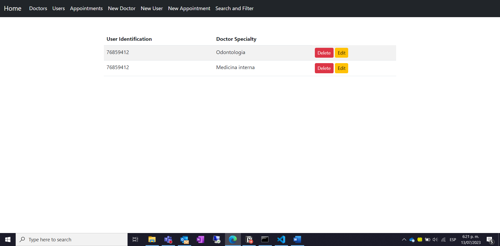

# Aplicación de citas
## Features
Aplicativo que ejecuta operaciones CRUD por medio de una API REST básica. Permite realizar las siguientes acciones:

- Crear un doctor con una especialidad
- Crea un usuario (No se permite mas de un usuario con el mismo número de documento de identidad)
- Crear una cita para un usuario específico y una especialidad existente de algún doctor
- Verificar todos los doctores disponibles
- Verificar todos los usuarios disponibles
- Verificar todas las citas disponibles
- Editar o eliminar los doctores existentes
- Editar o eliminar los usuarios existentes. La edición de usuarios no permite editar el documento de identidad
- Editar o eliminar las citas existentes
- Buscar las citas para cada usuario por documento de identidad
- Filtar las citas por especialidad

## Módelo de datos
En la siguiente imagen se observa el módelo de datos (diagrama) sobre el cual se crearon los modelos para las colecciones de la base de datos no relacional. 


Se realiza un diagrama donde se visualizan las colecciones creadas en la base de datos:

- Doctor
- User
- Appointment
- Specialty

Se crea una colección con las especialidades, con el fin de que al crear un doctor, se valide si la especialidad esta contenida en dicha colección y por ende, sea permitido crear al Doctor.

## Tecnologías utilizadas
Se utilizaron las siguientes tecnologías:

- [Node.js](https://nodejs.org/en)
- [Express](https://expressjs.com/es/)
- [MongoDB](https://www.mongodb.com/)
- [EJS](https://ejs.co/)

Se utilizan los siguientes paquetes

- [nodemon](https://nodemon.io/)
- [dotenv](https://github.com/motdotla/dotenv#readme)
- [ejs](https://ejs.co/)
- [express-validator](https://express-validator.github.io/docs)
- [mongoose](https://mongoosejs.com/)

## Orden del proyecto
Se crean las siguientes carpetas (con una breve explicación de su contenido)

- controllers -> Archivos que manejan la lógica una vez se realiza el enrutamiento por medio del EndPoint y del verbo HTTP.
- database -> Contiene un archivo con la conexión a la BD.
- helpers -> Contiene un archivo que realiza validaciones básicas una vez el usuario realiza POST o PUT por medio de los formularios de ingreso o actualización. Revisa los datos ingresados y verifica si los datos son correctos. 
- middlewares -> Contiene un archivo con middlewares.
- models -> Posee los modelos y Schemas que se utilizan para el ingreso de datos a la base de datos. Adicionalmente posee la clase Server que es el punto de entrada para el levantamiento del servidor.
- public -> Archivos CSS y JS que se utilizan desde el lado del FrontEnd. Posee los archivos que se utilizan para editar, eliminar, buscar y filtrar, con sus respectivas peticiones desde el Front al Back.
- routes -> Contiene los archivos que permiten enrutar las peticiones realizadas por los usuarios.
- views -> Contiene los archivos EJS que renderizan las vistas en el FrontEnd. 

## Instalación

1. Clonar el repositorio con el siguiente comando

```
git clone https://github.com/jucramirezay/doctor_appointments.git
cd doctor_appointments
```

2. Instalar los paquetes requeridos

```
npm install 
```

3. Correr el siguiente comando para iniciar el proyecto

```
npm run dev
```

!!! Importante: Para ejecutar el comando anterior se require tener instalado nodemon de forma global en el equipo

4. Abrir el explorador en la ruta https://127.0.0.1:3000

El archivo .env debe ser creado para que la API funcione, teniendo en cuenta especialmente la conexión con la BD. Las variables que se deben crear en el archivo .env para que el proyecto funcione correctamente son:

- PORT
- HOST
- DB_CONNECTION

PORT simboliza el puerto de conexión del servidor (3000). HOST simboliza el host sobre el cual se levantara el servidor (127.0.0.1). DB_CONNECTION es el String de conexión a la BD no relacional de MongoDB (link de conexión que es entregado en Mongo Atlas), que incluye usuario y contraseña para el correcto ingreso. 

## Documentación	
En las siguientes líneas de mostrara de forma breve el funcionamiento de la API

### Crear un nuevo doctor
Formulario para la creación de un doctor


Mensaje que indica que la creación del doctor ha sido exitosa


Se crea otro doctor y se valida en la lista los doctores creados


### Crear un nuevo usuario
Formulario para la creación de un usuario


Mensaje que indica que la creación del usuario ha sido exitosa


Se crea otro usuario y se valida en la lista los usuarios creados


Se intenta crear otro usuario con un número de identificación existente


### Crear una nueva cita
Formulario para la creación de una cita


Mensaje que indica que la creación de la cita ha sido existosa


Se crea una nueva cita y se valida en la lista las citas creadas


Se intenta crear una cita para un usuario inexistente pero una especialidad existente


Se intenta crear una cita para un usuario existente pero una especialidad inexistente


### Eliminar un doctor
Se puede eliminar un doctor por medio del botón "delete" que se encuentra en la lista de todos los doctores


Si solamente hay un doctor con esa especialidad, todas las citas que tengan esa especialidad también serán eliminadas. En caso de que hayan mas doctores con esa especialidad, las citas se mantendran.




Una vez se elimina el doctor con la especialidad única, la cita asociada a ese doctor ya no existe ni el doctor tampoco.


### Eliminar un usuario
Se puede eliminar un usuario por medio del botón "delete" que se encuentra en la lista de todos los usuarios


Una vez se elimina el usuario, también serán eliminadas las citas asociadas a dicho usuario.


### Eliminar una cita
El proceso de eliminación de la cita se hace por medio del botón "delete" que se encuentra en la lista de todas las citas (para este proceso se debí crear una nueva cita porque en el ejemplo anterior quedo el sistema de citas totalmente vació como se vio en la última imagen).


### Edición de doctor
Se pueden editar los datos del doctor por medio del botón "Edit" ubicado en la lista general de doctores. 


### Edición de usuario
Se pueden editar los datos del usuario por medio del botón "Edit" ubicado en la lista general de usuarios. Es importante aclarar que el único parámetro que no se permite editar de un usuario es el número de identificación. 


### Edición de una cita
Se pueden editar los datos de una cita por medio del botón "Edit" ubicado en la lista general de citas. Es importante aclarar que el único parámetro que se permite editar en una cita es la especialidad del médico, el número de identificación del usuario no es permitido editarlo. 


Cabe aclarar que si no existe un doctor con la especialidad que se desea editar, no se puede realizar la edición.


### Busqueda
Se puede realizar la busqueda de las citas que se encuentren asignadas para cada paciente de acuerdo a su número de identificación.


Si el usuario no existe se genera un mensaje que indica que la busqueda realizada no tiene resultados


### Filter 
Se pueden filtrar las citas por medio de la especialidad.


Si no existen citas con la especialidad indicada, el formulario de filtro no tendra las otras especialidades, por ejemplo, solamente hay una cita con la especialidad medicina interna, el formulario mostrara solamente dicha especialidad.


## Información personal
Creador: Juan Camilo Ramírez
Licencia: MIT License
Curso: ATENEA - Universidad Distrital - Todos a la U
Fecha realización: 04/07/2023
